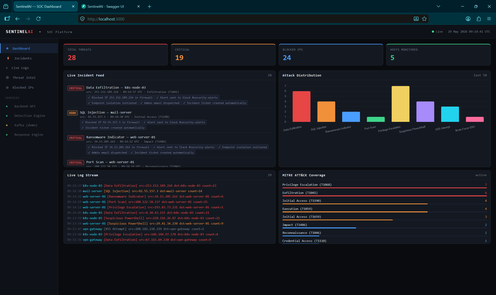
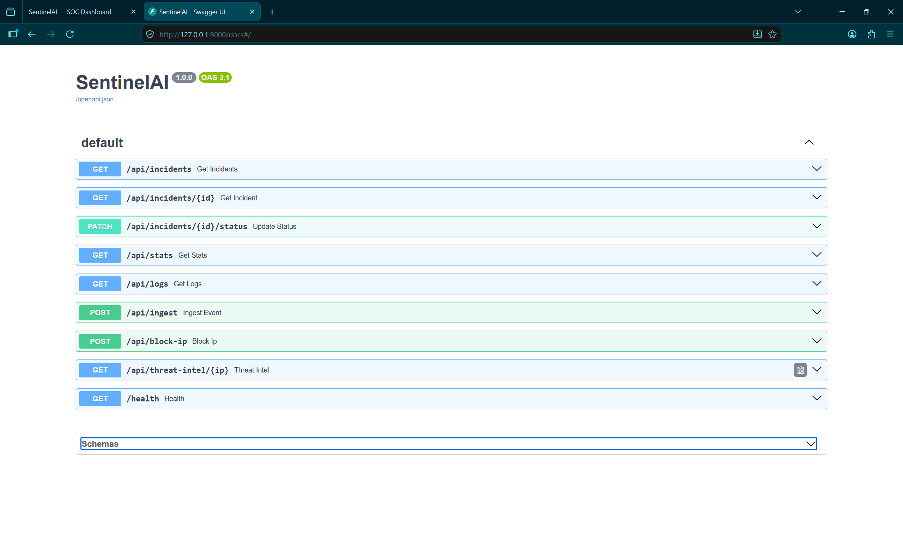

<<<<<<< HEAD
# SentinelAI — Cyber Threat Detection Platform

AI-powered SOC platform: real-time threat detection, automated incident response, live dashboard.

## Quick Start (3 steps)

### Step 1 — Requirements
- Python 3.9+ (download: https://python.org)
- That's it for basic mode

### Step 2 — Run the backend

**Linux / Mac:**
```bash
cd sentinelai
bash scripts/run.sh
```

**Windows:**
```
Double-click scripts\run_windows.bat
```

**Or manually:**
```bash
cd sentinelai
python3 -m venv venv
source venv/bin/activate          # Windows: venv\Scripts\activate
pip install -r backend/requirements.txt
uvicorn backend.main:app --host 0.0.0.0 --port 8000 --reload
```

### Step 3 — Open the dashboard

Open `frontend/index.html` in your browser.

**Or serve it properly:**
```bash
python3 -m http.server 3000 -d frontend
# then open http://localhost:3000
```

---
## 📸 Hardware Photos

| FRONTEND | BACKEND |
|-------------------------------|------------------------|
|  |  |


## URLs

| URL | What it is |
|-----|-----------|
| `http://localhost:8000/health` | Backend health check |
| `http://localhost:8000/docs` | Interactive API docs (Swagger) |
| `http://localhost:8000/api/incidents` | JSON list of all incidents |
| `http://localhost:8000/api/stats` | Dashboard statistics |
| `http://localhost:8000/api/logs` | Recent log events |
| `ws://localhost:8000/ws` | WebSocket live feed |

---

## Connect a Real Server (Linux)

Install the log agent on any Linux machine:
```bash
# On the server you want to monitor:
pip install requests
SENTINEL_HOST=http://YOUR_SENTINELAI_IP:8000 python3 agents/log_agent.py
```

The agent watches: `/var/log/auth.log`, `/var/log/syslog`, nginx/apache access logs.

---

## Send Events via API

Any system can push events directly:
```bash
curl -X POST http://localhost:8000/api/ingest \
  -H "Content-Type: application/json" \
  -d '{"host":"web-01","type":"auth_failure","src_ip":"1.2.3.4","details":"SSH brute force"}'
```

Supported event types: `auth_failure`, `sql_injection`, `port_scan`, `malware`, `powershell`

---

## Docker (optional)

```bash
cd docker
docker compose up -d
```

---

## Add Real Threat Intel

1. Copy `.env.example` to `.env`
2. Add your API keys:
   - VirusTotal: https://www.virustotal.com/gui/my-apikey
   - AbuseIPDB: https://www.abuseipdb.com/account/api
3. Restart the backend

---

## Project Structure

```
sentinelai/
├── backend/
│   ├── main.py          ← FastAPI server (detection + response engine)
│   ├── requirements.txt
│   └── Dockerfile
├── frontend/
│   └── index.html       ← Full SOC dashboard (no build step needed)
├── agents/
│   └── log_agent.py     ← Install on servers you want to monitor
├── scripts/
│   ├── run.sh           ← Linux/Mac start script
│   └── run_windows.bat  ← Windows start script
├── docker/
│   └── docker-compose.yml
└── .env.example
```

---

## How Detection Works

1. Events arrive via WebSocket log agent or HTTP POST to `/api/ingest`
2. Detection engine runs 3 layers: rule-based → signature → severity scoring
3. Response engine auto-blocks IPs and logs actions
4. Dashboard updates in real time via WebSocket

In demo mode (no agents connected), the backend simulates realistic attacks every 3–8 seconds so you can see everything working immediately.
=======
# SentinelAI
>>>>>>> 06786c9759a5be15ba7af6263dc31175034f62ed
